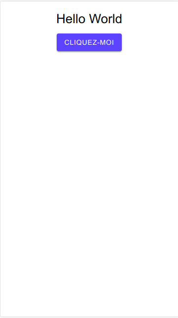
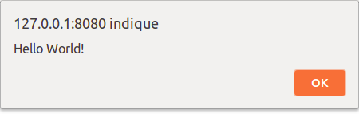
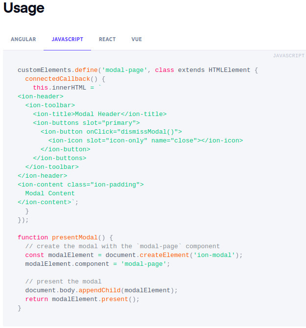
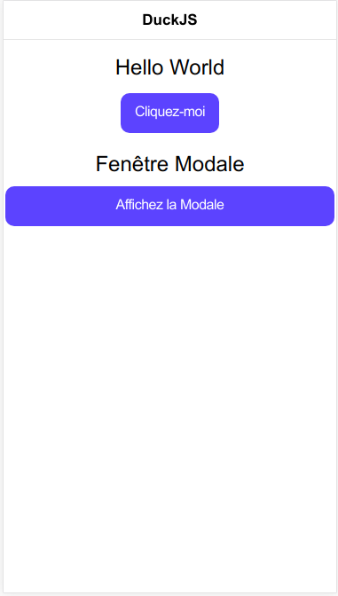
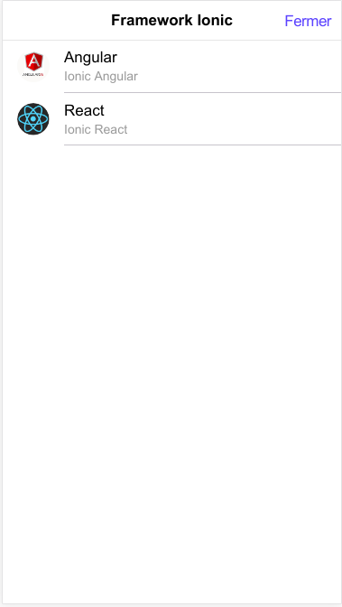

# Développer avec Ionic sans Framework JavaScript (Vanilla JS)


Historiquement, Ionic s'est toujours appuyé sur Angular pour la réalisation d'applications mobiles. Avec la version 4, la donne a totalement changé, car il est désormais possible de développer en Ionic...sans Framework JavaScript (Angular, React,...).

Oui, juste en pure JavaScript (ou Vanilla JS pour les intimes).

## Importer Ionic dans votre projet Web

Supposons notre application ne dispose pour le moment que d'un simple fichier **index.html**. Nous allons pouvoir importer les styles CSS et scripts Ionic pour utiliser les composants du Framework.

**index.html**
```html
<head>
  <title>Mon Application Ionic en Pur JS </title>
  <!-- ... -->
  <!-- Import du CSS Ionic -->
  <link href="https://unpkg.com/@ionic/core@latest/css/ionic.bundle.css" rel="stylesheet">

  <!-- Import du package Ionic -->
  <script src="https://unpkg.com/@ionic/core@latest/dist/ionic.js"></script>

  <!-- Import des icones Ionic  (Optionnel) -->
  <script src="https://unpkg.com/ionicons@latest/dist/ionicons.js"></script>
</head>
```
 Voilà !

 C'est tout ce dont vous avez besoin pour pouvoir utiliser Ionic dans votre application.
 Alors, heureux-se ? :-)

## Application simple : Hello world

Ajoutons quelques composants Ionic à notre fichier **index.html** et voyons quel résultat nous obtenons.
Au passage, nous rajouterons quelques métadonnées pour rendre notre application plus mobile-friendly.

**index.html**

```html
<!DOCTYPE html>
<html>

<head>
  <!-- En-tête du document  -->
  <meta charset="utf-8" />

  <!--  Quelques Meta données pour appli mobile -->
  <meta name="viewport" content="viewport-fit=cover, width=device-width, initial-scale=1.0, minimum-scale=1.0, maximum-scale=1.0, user-scalable=no" />
  <meta name="format-detection" content="telephone=no" />
  <meta name="msapplication-tap-highlight" content="no" />

  <!-- Ajout en page d'accueil (ios) -->
  <meta name="apple-mobile-web-app-capable" content="yes" />
  <meta name="apple-mobile-web-app-status-bar-style" content="black" />

  <title>Mon Application Ionic en Pur JS </title>

  <!-- Import du CSS Ionic -->
  <link href="https://unpkg.com/@ionic/core@latest/css/ionic.bundle.css" rel="stylesheet">

  <!-- Import du package Ionic -->
  <script src="https://unpkg.com/@ionic/core@latest/dist/ionic.js"></script>

  <!-- Import des icones Ionic  (Optionnel) -->
  <script src="https://unpkg.com/ionicons@latest/dist/ionicons.js"></script>

</head>

<body>
  <!-- Corps du document  -->

  <!-- Fonction affichant une simple alerte "Hello world" -->
  <script>
    hello = async function() {
      alert('Hello World!');
    };
  </script>

  <!-- On déclare ici notre application Ionic avec le tag <ion-app/> -->
  <ion-app>
    <!-- On peut même appeler des styles CSS propres à Ionic -->
    <ion-content class="ion-text-center">
      <h1>Hello World</h1>
      <!-- Un simple évenement click -->
      <ion-button onclick="hello()" expand="block">Cliquez-moi</ion-button>
    </ion-content>
  </ion-app>
</body>

</html>

```

Pour tester notre application en local, nous allons installer le package http-server :

```bash
$ npm install -g http-server
```

Il reste plus qu'à lancer notre application en saisissant la commande suivante depuis la racine de votre projet :

**/chemin/complet/vers/monprojet/**

```bash
$ http-server

Starting up http-server, serving ./
Available on:
  http://127.0.0.1:8080
  http://192.168.43.98:8080

```

On obtient le beau résultat suivant :

Je suis un bouton | Hello ! |
--- | --- |
 |  |

Si vous souhaitez rajouter d'autres composants Ionic, rien de plus simple.

Depuis la (documentation officielle)[https://ionicframework.com/docs/api/], vous n'avez qu'à cliquer sur l'onglet **'JavaScript'** pour récupérer la définition de votre composant.

Affichons par exemple une fenêtre modale à notre petite application.
Pour cela, on récupère le code JavaScript du composant à l'adresse : https://ionicframework.com/docs/api/modal



On va pouvoir l'adapter un peu pour afficher nos propres informations, à savoir une liste de framework :

```html

<body>
  <!-- Corps du document  -->

  <script>
    // Application du code quand le DOM est prêt
    document.addEventListener('DOMContentLoaded', function() {
      // Document ready

      // Fonction affichant une simple alerte "Hello world"
      hello = async function() {
        alert('Hello World!');
      };

      let
        currentModal = null,
        controller = document.querySelector('ion-modal-controller');

      // Fonction affichant une fenetre modale
      createModal = async function() {
        controller.create({
          component: 'modal-content'
        }).then(modal => {
          modal.present();
          currentModal = modal;
        });
      }

      // Fonction permettant la fermeture de la fenêtre modale
      dismissModal = async function() {
        if (currentModal) {
          currentModal.dismiss().then(() => {
            currentModal = null;
          });
        }
      }

      // On définit ensuite le contenu de la fenêtre modale
      // Qui affichere simplement les Framework pris en Charge par Ionic
      customElements.define('modal-content', class ModalContent extends HTMLElement {
        connectedCallback() {
          this.innerHTML =
            `
          <ion-header translucent>
            <ion-toolbar>
              <ion-title>Framework Ionic</ion-title>
              <ion-buttons slot="end">
              <ion-button onclick="dismissModal()">Fermer</ion-button>
              </ion-buttons>
            </ion-toolbar>
          </ion-header>
          <ion-content fullscreen>
              <ion-list>
                  <ion-item>
                    <ion-avatar slot="start">
                      <ion-img src="./assets/logo-angular.jpg"/>
                    </ion-avatar>
                    <ion-label>
                      <h2>Angular</h2>
                      <p>Ionic Angular</p>
                    </ion-label>
                  </ion-item>
                  <ion-item>
                      <ion-avatar slot="start">
                      <ion-img src="./assets/logo-react.jpeg"/>
                      </ion-avatar>
                      <ion-label>
                        <h2>React</h2>
                        <p>Ionic React</p>
                      </ion-label>
                  </ion-item>
            </ion-list>
          </ion-content>`;
        }
      });
    });
  </script>


  <!-- On déclare ici notre application Ionic avec le tag <ion-app/> -->
  <ion-app>
    <ion-header>
      <ion-toolbar>
        <ion-title>DuckJS</ion-title>
        <ion-buttons slot="primary">
          <ion-button onClick="dismissModal()">
            <ion-icon slot="icon-only" name="close"></ion-icon>
          </ion-button>
        </ion-buttons>
      </ion-toolbar>
    </ion-header>
    <!-- On peut même appeler des styles CSS propres à Ionic -->
    <ion-content class="ion-text-center">
      <!-- Un simple évenement clic -->
      <h2>Hello World</h2>
      <ion-button onclick="hello()">Cliquez-moi</ion-button>

      <!--  Affiche une fenetre modale -->
      <h2>Fenêtre Modale</h2>
      <ion-button id="button-modal" onclick="createModal()" expand="block">Affichez la Modale</ion-button>

    </ion-content>

    <!--  Notre fenetre modale s'affichera ici -->
    <ion-modal-controller></ion-modal-controller>
  </ion-app>
</body>

```

Qui donne le résultat :

Je suis une fenêtre modale | Hello ! |
--- | --- |
 |  |

Voilà ! Vous pouvez à présent créez vos applications Ionic avec uniquement du JavaScript ou simplement l'inclure à vos projets web actuels.
